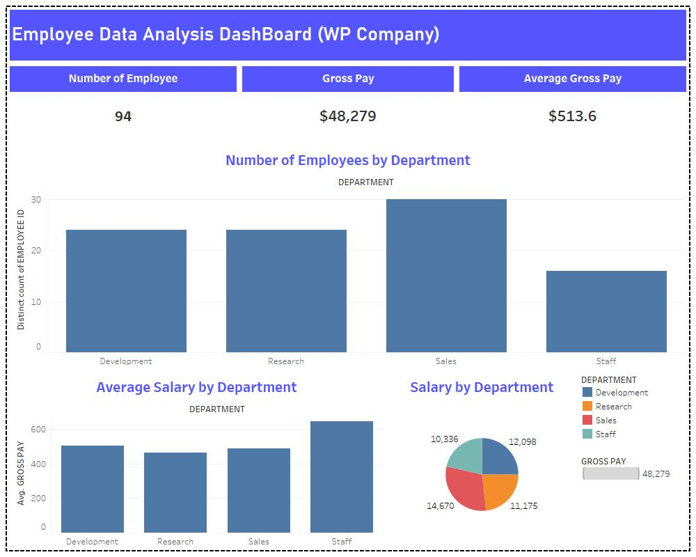

# WP Company Employee Data Analysis
---

## Introduction
This project aims to analyze a dataset containing employee information, potentially for a Human Resources department.  By understanding the data, the HR department can gain insights into employee demographics, work tenure, and other factors that might influence human resource decisions.

## Problem Statement
1. Are there any trends in hiring across departments?
2. What's the distribution of salaries across departments?
3. Are there any employees with exceptionally high or low hours worked?
   

## Skills Demonstrated
- Data Analysis With Tableau: Understanding and exploring the provided dataset.
- Data Transformation: Cleaning and shaping the data for Tableau.
- Data Visualization: Creating charts and graphs to represent the data visually.
- Tableau Desktop: Using Tableau to create interactive visualizations.

## Data Sourcing
The data for this project is a simple table containing employee information, including:

- Employee ID
- First Name
- Last Name
- Division
- Department
- Date of Hire
- Benefit Code
- Possible Hours Worked
- Hourly Rate
- Gross Pay
- Full/Part Time indicator
- Year of Hire
- Month of Hire

## Data Transformation
- Removing duplicate entries
- Handling missing values
- Converting data types

## Modeling

No complex modeling is required for this basic visualization project.

## Analysis and Visualization
We use Tableau Desktop to connect to the data and create visualizations to explore different aspects of the employee data. Here are the visualizations:

- Number of Employees by Department: A bar chart can show the number of employees in each department. This can help identify which departments have the most or least staff.

- Average Salary by Department: A bar chart can show the average salary for each department. This can help identify any pay disparities between departments.

## Conclusion
This analysis provides the HR department with a foundational understanding of the employee data. It reveals the distribution of employees across departments, highlights potential pay disparities, and identifies outliers in terms of hours worked.

## Recommendation
Based on the initial findings, further analysis is recommended to delve deeper into the following areas:

**Hiring Trends**: Analyze trends in hiring across departments over time. This could be visualized with a line chart showing department headcount changes year-over-year.

**Salary Distribution**: Explore the distribution of salaries within each department. Consider using boxplots to identify potential outliers and salary ranges within departments.

**Hours Worked**: Investigate reasons behind exceptionally high or low hours worked. This might involve filtering the data by department or full/part-time status.

**Experience vs. Salary**: Go beyond a simple correlation and consider factors like department and position when analyzing the relationship between years of experience and salary.

Further analysis with these recommendations will provide the HR department with more comprehensive insights to inform strategic decisions.

😊

